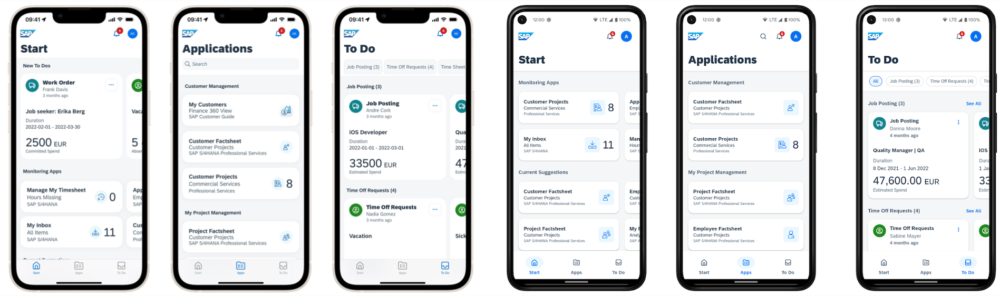

# DT162 - Learn How to Set Up and Configure SAP Mobile Start with SAP S/4HANA

## Description

This repository contains the material for the SAP TechEd 2023 session called DT162 - Learn How to Set Up and Configure SAP Mobile Start with SAP S/4HANA.

    

## Overview

The SAP Mobile Start app is your native entry point to SAP’s mobile universe.
Discover how to set up and configure SAP Mobile Start with SAP S/4HANA and how to add your native apps. You will understand all the prerequisites and necessary steps.

## Requirements

The requirements to follow the exercises in this repository are:

- SAP BTP Subaccount with SAP Build Work Zone, standard edition* entitlement
- Admin access for this subaccount
- SAP S/4HANA system connected to the SAP BTP Subaccount
- Content Exposure from SAP S/4HANA to SAP Build Work Zone, standard edition
  - [S/4HANA Cloud Edition](https://help.sap.com/docs/CIAS%20LPD%20for%20S_4%20Cloud/b4ae4453db454f1d8775a4f69826453f/069f16288f394305a7be38a480384807.html?locale=en-US)
  - [S/4HANA On Premise](https://help.sap.com/docs/CIAS%20FES%202020/ecb81b5bfce440ca8e7e7c9ad58fcf3a/98a3f0830f084aefb5ea75fb20959af5.html?locale=en-US)
- Roles assigned to the user in SAP S/4HANA matching the exposed content
- A mobile phone (iOS or Android) capable of running SAP Mobile Start

## Exercises

> **NOTE:** For the SAP TechEd 2023 Hands-on Session we have already prepared the landscape with **SAP Build Work Zone, standard edition**. Please start directly with [Exercise 1](../ex1) as an in-person participant.

- [Exercise 0 - Access SAP Build Work Zone, standard edition](exercises/ex0/) (skip on TechEd 2023 Hands-on)
- [Exercise 1 - Create a Content Channel to import SAP S/4HANA Content](exercises/ex1/)
- [Exercise 2 - Create own content in Site Manager](exercises/ex2/)
- [Exercise 3 - Create Native App Tile for SAP Mobile Start](exercises/ex3/)
- [Exercise 4 - Create News Feed Tile for SAP Mobile Start](exercises/ex4/)

## System Access

The following list point the used systems for the Hands-on Workshop of SAP TechEd 2023.
Outside of the Workshop, separate systems might be required to execute the exercises.

- [Site Manager](https://xp161-dt162-x75hy9xc.dt.launchpad.cfapps.eu10.hana.ondemand.com/)
- S/4HANA System

## Further resources

- [SAP Mobile Start (SAP Community)](https://community.sap.com/topics/mobile-experience/start)
- SAP S/4HANA – Content Exposure & Integration Guide
  - [S/4HANA Cloud Edition](https://help.sap.com/docs/CIAS%20LPD%20for%20S_4%20Cloud/b4ae4453db454f1d8775a4f69826453f/069f16288f394305a7be38a480384807.html?locale=en-US)
  - [S/4HANA On Premise](https://help.sap.com/docs/CIAS%20FES%202020/ecb81b5bfce440ca8e7e7c9ad58fcf3a/98a3f0830f084aefb5ea75fb20959af5.html?locale=en-US)
- [Identity Provisioning (Documentation)](https://help.sap.com/docs/Launchpad_Service/8c8e1958338140699bd4811b37b82ece/1c231333f1d24ae0a8e60ce688c4f692.html)

## Download SAP Mobile Start

You can download SAP Mobile Start for iOS and Android in the respective App Stores.

## Contributing

Please read the [CONTRIBUTING.md](./CONTRIBUTING.md) to understand the contribution guidelines.

## Code of Conduct

Please read the [SAP Open Source Code of Conduct](https://github.com/SAP-samples/.github/blob/main/CODE_OF_CONDUCT.md).

## How to obtain support

Support for the content in this repository is available during the actual time of the online session for which this content has been designed. Otherwise, you may request support via the [Issues](../../issues) tab.
Please open a regular support ticket for issues concerning **SAP Mobile Start** itself.

- [Documentation for SAP Mobile Start on SAP Help](https://help.sap.com/docs/SAP_MOBILE_START?locale=en-US)

## License

Copyright (c) 2023 SAP SE or an SAP affiliate company. All rights reserved. This project is licensed under the Apache Software License, version 2.0 except as noted otherwise in the [LICENSE](LICENSES/Apache-2.0.txt) file.
